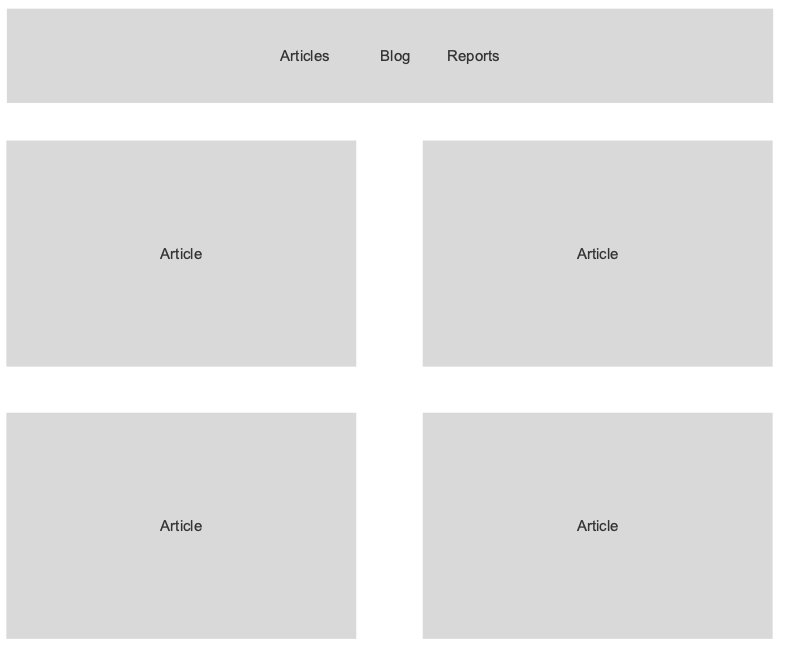
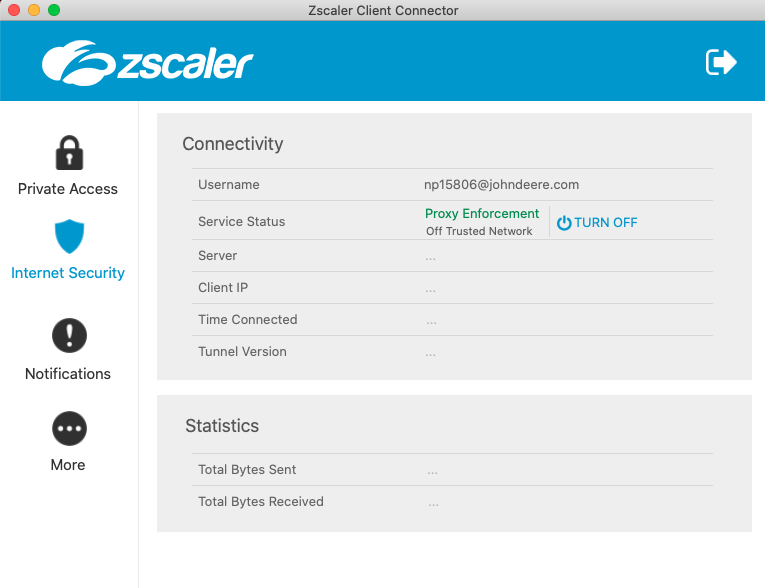

## Project 3: Space News

### Project Plan
Project 3 is building an app with React and API. We decided to use [https://thespacedevs.com/snapi] 

We decided to use the react-router-lab (National Park Service) homework and NASA.gov as a template.




App.js
* loading API info into *articleList*
* passing *articleList* as a prop to *articleList*
* using *nav* to hold link to *ArticleList*

ArticleList.js
* *Link to="/"*
* mapping through *articleList* and displaying *article*

ArticleDetail.js
* route *Route path="/article/:id"*

### Project Links

[Here is the project repository.](https://github.com/bruce123123/space-news)
[Here is the published project.](http://space-news.surge.sh/)

### Technical Goals


### Technology Used
* React
* Axios

### Example Code

```            
<Link to={`/articles/${article.id}`}>
     e.target.src=".././images-error.png"} alt="image" />
    <h2 className="list-image-text">{article.title}</h2>
</Link>
```


### Issues and Resolutions
 Neal received this error when trying to load the API data. Leo recommended a CORS extension which seemed to resolve the error, but Neal was unable to see the array data in the console.  He found a setting in zscaler that was causing the issue 

We had some issues with copying CSS styles from another project, we ended up deleting and retyping most of the CSS file.

Struggled with centering text with absolute position. Below is the solution.
https://stackoverflow.com/questions/18147642/css-centering-absolute-positioned-text-inside-relative-parent

React documentation used to explain how to highlight the nav menu item that is active
https://reacttraining.com/react-router/web/api/NavLink

Encountered 404 "File not found" error while loading an image from the API.
Following is the before and after image


    
### User Stories


### Additional Comments
